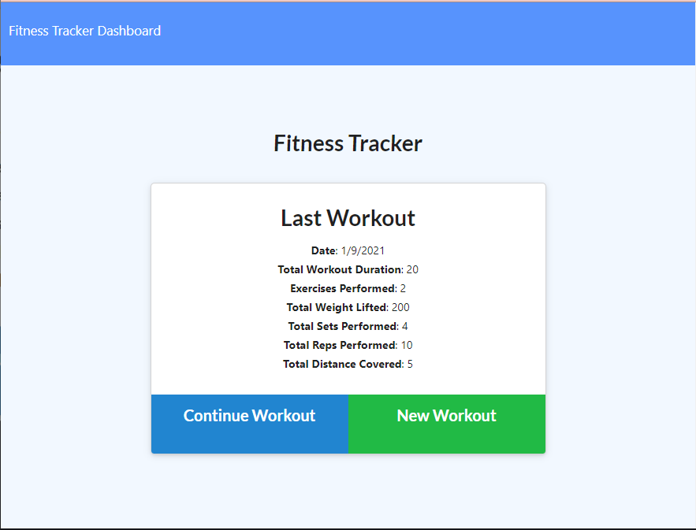
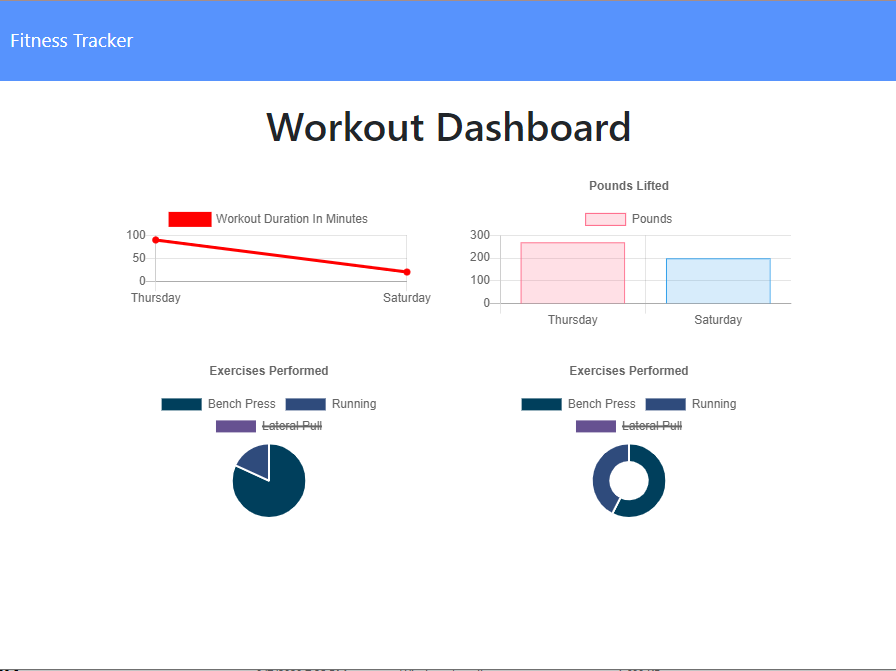

# workout-tracker
Workout tracker helps you to view and track daily workouts. Workout tracker saves all the exercises and gives you a total exercises information in static graph. User can add or update workouts with type, weight, reps, sets and durations. Keep track of every exercise in your workout with workout-tracker app. 

## Table of Contents
* [URLs](#URLs)
* [Usage](#usage)
* [Questions](#questions)
* [License](#license)

## URLs
1. Deployed URL (Heroku):
    ( https://polar-refuge-64254.herokuapp.com/ )

2. Github Page URL: 
[Github](https://github.com/Songhee95/workout-tracker)

## Usage

## Questions
If you have any questions or need any help, feel free to contact me here  
Github page: [Github](https://github.com/songhee95/)  
Email: thdgml5537@gmail.com

## License
Copyright (c) 2020 SONGHEE YIM

Permission to use, copy, modify, and/or distribute this software for any
purpose with or without fee is hereby granted, provided that the above
copyright notice and this permission notice appear in all copies.

THE SOFTWARE IS PROVIDED "AS IS" AND THE AUTHOR DISCLAIMS ALL WARRANTIES
WITH REGARD TO THIS SOFTWARE INCLUDING ALL IMPLIED WARRANTIES OF
MERCHANTABILITY AND FITNESS. IN NO EVENT SHALL THE AUTHOR BE LIABLE FOR
ANY SPECIAL, DIRECT, INDIRECT, OR CONSEQUENTIAL DAMAGES OR ANY DAMAGES
WHATSOEVER RESULTING FROM LOSS OF USE, DATA OR PROFITS, WHETHER IN AN
ACTION OF CONTRACT, NEGLIGENCE OR OTHER TORTIOUS ACTION, ARISING OUT OF
OR IN CONNECTION WITH THE USE OR PERFORMANCE OF THIS SOFTWARE.
